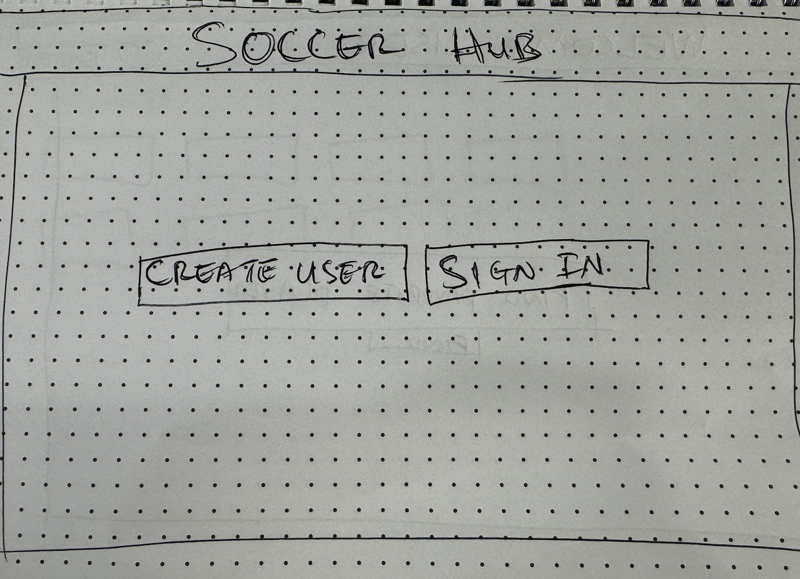
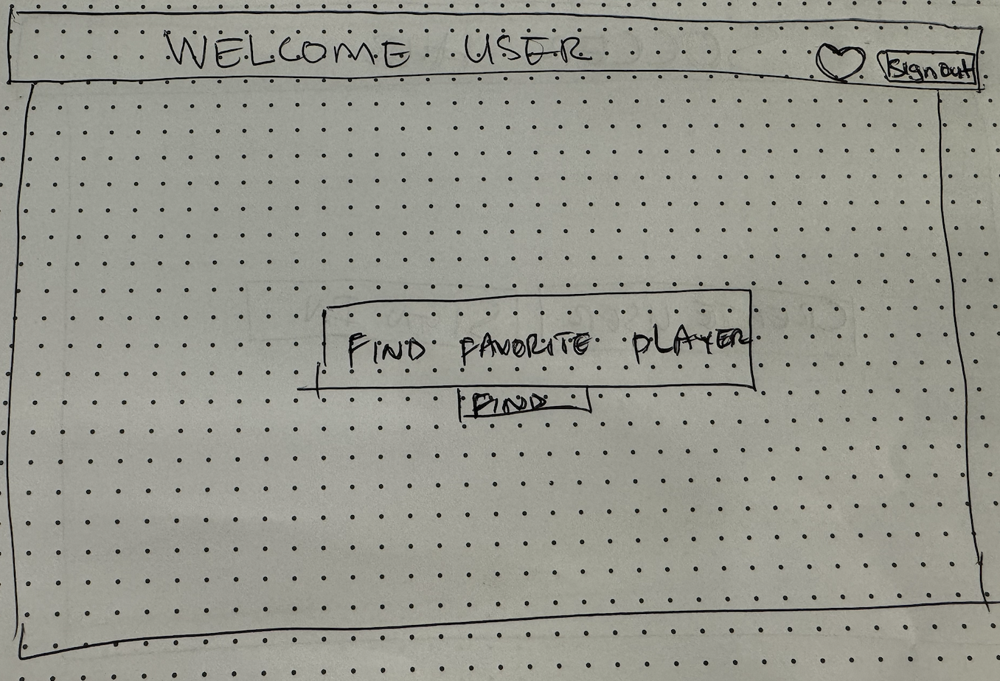
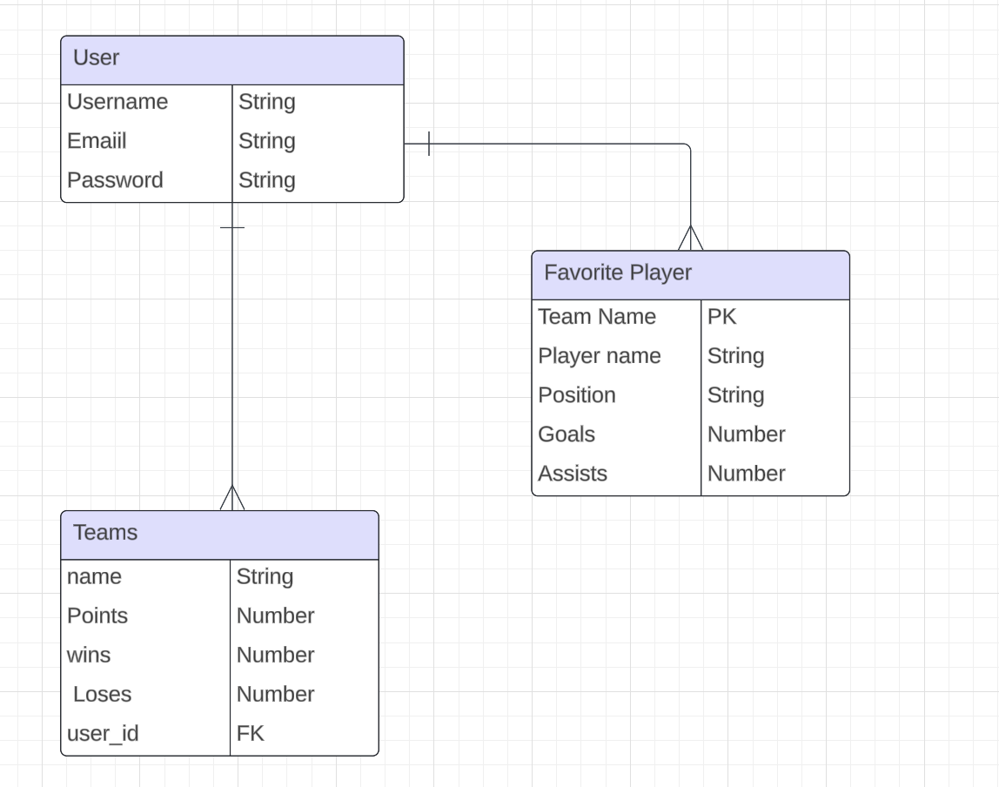

# my API proposal

For the second Project, I am building a Soccer API. This API will allow users to interact with their favorite premier league data, including match results, team stats, and player information. This API will also allow users to add players as their favorites to make it easy to access players they are interested in.

    
## User Stories

 - *As a user, I want to be able to view a list of my favorite players, so that I can see all the players I am most interested in without having to search for them every time*
- *As a user, I want to be able to add players to my list of favorite players, so that I can quickly access their details and updates*
- *As a User, i want to be able to search for players,when i find a player, i want to be able to add them to my favorites.* 
- *As a user, i want to have the option to remove my favorite player*
- *As a user, I want to see immediate updates to my list of favorite players whenever I add or remove players, so that my list always reflects my current interests.*
- *As a user, if I attempt to add or remove players from my favorites list while not being logged in, I want to receive an error message informing me that I need to log in first*

### Stretch Goals
- [] As a User, i want to be able to click on a player and see his season stats
- [] As a User, i want to be able to create a fantasy team based on my favorite players

# Route Table

| **Route**                        | **Method** | **Description**                                            | **Controller Function**  |
|----------------------------------|------------|------------------------------------------------------------|--------------------------|
| /Auth/signup                          | POST       | Create a new user account.                                | `signupUser`            |
| /Auth/login                           | POST       | Log in an existing user.                                  | `loginUser`             |
| /users/:userId/favorites          | GET        | Retrieve a list of favorite players for the user.         | `getFavoritePlayers`     |
| /users/:userId/favorites/addNew   | POST       | Add a player to the user's list of favorite players.      | `addFavoritePlayer`      |
| /users/:userId/favorites/:playerId| DELETE     | Remove a player from the user's list of favorite players. | `removeFavoritePlayer`   |

## ERD

## Plan of Attack

|    Day        |                           Task                            |
|:---------:    |:--------------------------------------------------------: |
|   Friday      | Create and present proposal                               |
|  Saturday     | Create ejs, css, js files, and create basic structure.    |
|   Sunday      | Begin functions                                           |
|   Monday      | Continue functions                                        |
|  Tuesday      | Add CSS                                                   |
| Wednesday     | Finalize functions                                        |
|  Thursday     | Review project with instructor                            |
|   Friday      | Overview and launch project                               |
|  Saturday     | Review/Stretch goals                                      |
|   Sunday      | Review/Stretch goals                                      |
|   Monday      | Present Project                                           |

 
